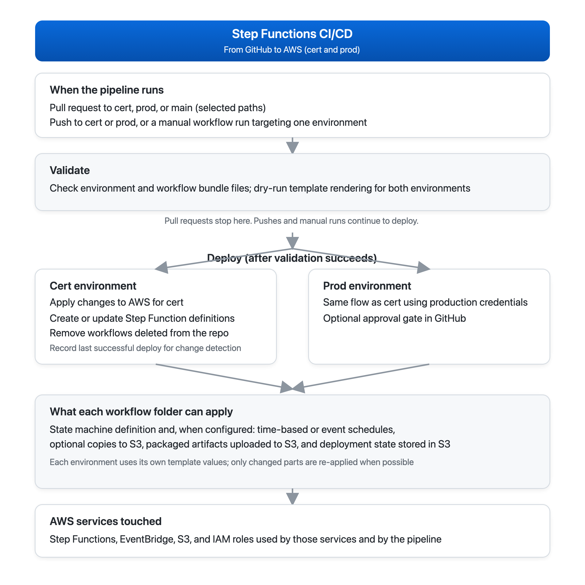
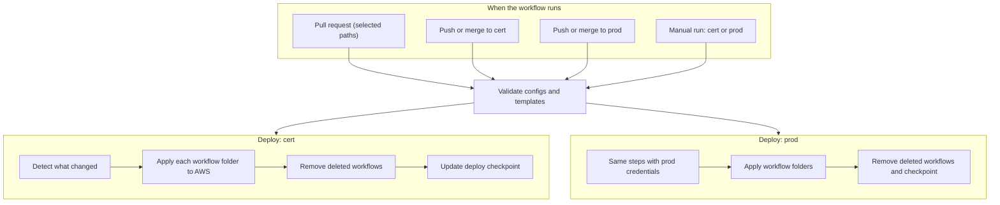
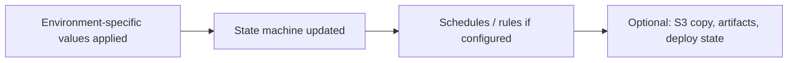

## Step Functions CI/CD (Folder-based bundles)

This repository deploys AWS Step Functions from source control using GitHub Actions.

Cert deployment is automatic on push/merge to `cert`.
Prod deployment is automatic on push/merge to `prod`.
Manual runs are also available via `workflow_dispatch`.
PRs run validation.

### CI/CD flow (diagrams)

**Overview diagram (repo root):**  
  
*Editable vector:* [`stepfunctions-cicd-trigger-flow.svg`](stepfunctions-cicd-trigger-flow.svg)

**GitHub Actions** (`.github/workflows/stepfunctions-cicd.yml`): every run starts with **`validate`** (bundle JSON + smoke render for `cert` and `prod`). **`deploy-cert`** and **`deploy-prod`** run only when the matching branch is pushed or when **`workflow_dispatch`** targets that environment; they depend on `validate` succeeding. On **`pull_request`**, only **`validate`** runs (deploy jobs are skipped by their `if` conditions).



**Per workflow folder**, the deploy step fills in environment-specific values, updates the state machine, configures schedules when present, and can copy data or publish artifacts to S3. Parts that are unchanged may be skipped using stored hashes (see [CI/CD behavior](#ci-cd-behavior)).



Each workflow is defined as a folder bundle:

1. `definition.asl.json` (**required**) state machine definition
2. `<env>-trigger.json` (optional, preferred) EventBridge trigger config
3. `<env>-input.json` (required only when trigger exists and EventBridge is enabled)
4. `<env>-s3copy.json` (optional, preferred, when S3 copy/update is needed)
5. `<env>-artifacts.json` (optional, preferred, when artifact tar/copy is needed)

---

## Directory structure

```text
.github/workflows/stepfunctions-cicd.yml
scripts/
  deploy_sfn.sh
  delete_sfn.sh
  update_sfn_state_checkpoint.sh
  detect_stepfunctions_changes.sh
  detect_changed_stepfunctions.sh
  render_asl.py
stepfunctions/
  env/
    cert.json
    prod.json
  workflows/
    <step-function-name>/
      definition.asl.json
      cert-trigger.json (optional, preferred)
      prod-trigger.json (optional, preferred)
      trigger.json      (optional fallback)
      cert-input.json   (required only when trigger is enabled)
      prod-input.json   (required only when trigger is enabled)
      input.json        (fallback for event input)
      cert-s3copy.json  (optional, preferred)
      prod-s3copy.json  (optional, preferred)
      s3copy.json       (optional fallback)
      cert-artifacts.json (optional, preferred)
      prod-artifacts.json (optional, preferred)
      artifacts.json      (optional fallback)
```

The workflow ID is the folder name under `stepfunctions/workflows/`.

---

## Workflow bundle format

### `definition.asl.json`

- Standard ASL definition.
- Supports `${KEY}` placeholders rendered from `stepfunctions/env/<environment>.json`.

### `<env>-trigger.json` / `trigger.json`

Controls EventBridge trigger behavior.

Example:

```json
{
  "comment": "Update this value to force trigger reapply",
  "stateMachine": {
    "type": "STANDARD",
    "tags": {
      "app": "orders",
      "managed-by": "github-actions"
    }
  },
  "eventBridge": {
    "enabled": true,
    "description": "Run orders workflow every 30 minutes",
    "scheduleExpression": "rate(30 minutes)",
    "state": "ENABLED",
    "targetId": "run-orders-workflow",
    "roleArn": "arn:aws:iam::123456789012:role/eventbridge-start-sfn"
  }
}
```

Notes:
- `eventBridge.enabled` defaults to `true`.
- `eventBridge.scheduleExpression` **or** `eventBridge.eventPattern` must be set (exactly one) when enabled.
- `eventBridge.roleArn` is required unless `EVENTBRIDGE_INVOKE_ROLE_ARN` env var is provided.
- `comment` is optional and included in trigger state hash; changing it forces trigger reapply.
- Trigger config file is only for EventBridge/state machine settings.
- Deploy/validate look up trigger config in this order:
  1. `<env>-trigger.json` (for example `cert-trigger.json`, `prod-trigger.json`)
  2. `trigger.json` (fallback)
- If neither trigger file exists, EventBridge setup is skipped.
- Event input is read only when EventBridge is enabled.
- S3 copy settings are read in this order:
  1. `<env>-s3copy.json` (for example `cert-s3copy.json`, `prod-s3copy.json`)
  2. `s3copy.json` (fallback)

#### Time and schedule format (`eventBridge.scheduleExpression`)

`scheduleExpression` must be either a **`rate`** or a **`cron`** string (set exactly one; do not combine with `eventPattern` in the same trigger).

- **`rate`** — run at a regular interval.  
  - Syntax: `rate( <number> <unit> )` where `unit` is one of: `minutes`, `hours`, or `days` (EventBridge enforces valid ranges; see the [EventBridge rate expressions](https://docs.aws.amazon.com/eventbridge/latest/userguide/eb-schedule-expressions.html) section in the AWS documentation).  
  - Examples: `rate(5 minutes)`, `rate(1 hour)`, `rate(1 day)`.

- **`cron`** — run on a wall-clock or calendar pattern. **All times are in UTC** (the rule does not use the Step Function or repository time zone).  
  - EventBridge `cron` uses **six** fields, space-separated, inside the parentheses:  
  `cron( Minutes Hours Day-of-month Month Day-of-week Year )`  
  - Wildcards: `*`, `?` (one of “day of month” or “day of week” should be `?` if the other is set), and day-of-month/day-of-week expressions such as `MON#1` (first Monday of the month).  
  - Examples:  
  - `cron(0 12 * * ? *)` — 12:00 **UTC** every day.  
  - `cron(0 0 ? * MON#1 *)` — midnight UTC on the **first Monday** of each month (as in the dummy per-env `cert`/`prod` **trigger** files).

- Choosing **`rate` vs `cron`**: use **`rate`** for “every *n* minutes/hours/days”; use **`cron`** for a specific clock time, weekday, or Nth day-of-month pattern in **UTC**. For a full field-by-field description, use the [EventBridge schedule expressions](https://docs.aws.amazon.com/eventbridge/latest/userguide/eb-cron.html) section in the AWS documentation.

A **fallback example** in this repository (`stepfunctions/workflows/dummy-ecs-run-task/trigger.json`) uses `rate(1 day)`; the per-environment trigger files in the same folder use **`cron`** and take priority when they exist (see the lookup order in this same trigger subsection). **`input.json` there** matches the shape of `cert-input.json` and documents the **fallback** input file. To wire **cert/prod** vs **fallback** files, see the **Developer guide** (section **4. EventBridge: `trigger` and `input` JSON** below in this file).

### `<env>-s3copy.json` / `s3copy.json` (optional)

Runs an S3 copy step during deployment.

```json
{
  "comment": "Update this value to force S3 copy rerun",
  "enabled": true,
  "mode": "files",
  "sourceUri": "s3://source-bucket/prefix/",
  "destinationUri": "s3://destination-bucket/prefix/",
  "files": [
    "config/file1.json",
    "input/file2.csv"
  ],
  "backupExisting": true,
  "backupTimestampFormat": "%Y%m%d%H%M%S"
}
```

### `<env>-artifacts.json` / `artifacts.json` (optional)

Runs artifact build/copy steps during deployment.  
Supports multiple tasks using a `tasks` array.

```json
{
  "tasks": [
    {
      "comment": "Build tar from batch.sql and upload",
      "enabled": true,
      "mode": "tar",
      "sourceSqlPath": "artifacts/x/xa/xy/batch.sql",
      "destinationUri": "s3://my-bucket/path/",
      "backupExisting": true,
      "backupTimestampFormat": "%Y%m%d%H%M%S"
    },
    {
      "comment": "Copy batch.sql directly",
      "enabled": true,
      "mode": "copy",
      "sourceFilePath": "artifacts/x/xa/xy/batch.sql",
      "destinationUri": "s3://my-bucket/path/batch.sql",
      "backupExisting": true,
      "backupTimestampFormat": "%Y%m%d%H%M%S"
    }
  ]
}
```

Artifact notes:
- File lookup order is:
  1. `<env>-artifacts.json`
  2. `artifacts.json` (fallback)
- If no artifacts file exists, artifact flow is skipped.
- `mode=tar` creates `<parent-dir-of-sourceSqlPath>.tar.gz`.
  - Example: `artifacts/x/xa/xy/batch.sql` -> `xy.tar.gz`
  - Equivalent tar command run from source directory: `tar -czf xy.tar.gz batch.sql`
- `mode=copy` uploads the source file directly.
- `destinationUri` must be `s3://...`
  - If URI ends with `/`, filename is appended automatically.
- Existing destination objects are backed up first when `backupExisting=true`.

Dummy example included in this repository:
- Source file: `artifacts/x/xa/xy/batch.sql`
- Workflow config: `stepfunctions/workflows/dummy-ecs-run-task/cert-artifacts.json`
  and `stepfunctions/workflows/dummy-ecs-run-task/prod-artifacts.json`
- Task behavior:
  - `mode=tar` creates `xy.tar.gz` from `batch.sql` and uploads to S3
  - `mode=copy` uploads `batch.sql` directly to S3

Notes:
- Use per-workflow variable names in env JSON for clarity, for example:
  - `DUMMY_ECS_RUN_TASK_COPY_SOURCE_URI`
  - `DUMMY_ECS_RUN_TASK_COPY_DESTINATION_URI`
- `comment` is optional and included in S3 copy state hash; changing it forces S3 copy rerun.
- `mode=files` copies only the listed relative paths from source prefix to destination prefix.
- When `backupExisting=true`, if a destination object already exists, it is backed up first as:
  - `<original-key>.<UTC timestamp>` (timestamp format configurable by `backupTimestampFormat`)
- `backupExisting=true` is supported with `mode=files`.
- To run multiple copy operations in one workflow deploy, use `tasks`:

```json
{
  "tasks": [
    {
      "enabled": true,
      "mode": "files",
      "sourceUri": "s3://source-a/prefix/",
      "destinationUri": "s3://dest-a/prefix/",
      "files": ["a.txt", "b.txt"],
      "backupExisting": true
    },
    {
      "enabled": true,
      "mode": "files",
      "sourceUri": "s3://source-b/prefix/",
      "destinationUri": "s3://dest-b/prefix/",
      "files": ["c.txt"]
    }
  ]
}
```

### `<env>-input.json` / `input.json`

- JSON payload passed to EventBridge target as the `Input` for `StartExecution`.
- Supports `${KEY}` placeholders rendered from env JSON.
- Deploy/validate look up input file in this order:
  1. `<env>-input.json` (for example `cert-input.json`, `prod-input.json`)
  2. `input.json` (fallback)
- The dummy workflow includes `stepfunctions/workflows/dummy-ecs-run-task/input.json` as a **fallback**-file example; per-env `cert-input.json` and `prod-input.json` are used in practice for that folder.

---

## Environment files

`stepfunctions/env/cert.json` and `stepfunctions/env/prod.json` provide template values
for definition, trigger, and input rendering.

---

## Naming templates

Deploy/delete scripts use deterministic names so delete can work even when a workflow folder is removed.

- State machine name template:
  - `SFN_STATE_MACHINE_NAME_TEMPLATE` (default: `sfn-__ENV__-__WORKFLOW__`)
- EventBridge rule name template:
  - `EVENTBRIDGE_RULE_NAME_TEMPLATE` (default: `__ENV__-__WORKFLOW__-trigger`)
- Event bus:
  - `EVENTBRIDGE_EVENT_BUS_NAME` (default: `default`)

`__WORKFLOW__` is the workflow folder name; `__ENV__` is the deployment environment.

---

## CI/CD behavior

### Validation

The workflow validates:
- all env JSON files
- each workflow bundle JSON
- rendered output for definition/trigger/input/s3copy/artifacts (using both `cert` and `prod` env files)
- trigger constraints (schedule vs event pattern)
- S3 URI format when S3 copy is enabled
- artifacts task format and source file paths (when artifacts config exists)

### Change detection

`scripts/detect_stepfunctions_changes.sh` emits:
- `DEPLOY:<workflow-dir>`
- `DELETE:<workflow-id>`

Rules:
- deploy changed workflow folders only
- env-only changes do not trigger deployment selection
- detect deletes/renames via git diff status

### Deploy

`scripts/deploy_sfn.sh <cert|prod> <workflow-dir>`:
- create/update Step Function
- if trigger config exists and EventBridge is enabled: create/update EventBridge rule + target
- if EventBridge is enabled: pass rendered env-scoped input payload to EventBridge target
- optionally run S3 copy (`files`, `sync`, or `cp`)
- optionally run artifacts tasks (`tar` or `copy`)
- update a persistent state file in S3 with separate hashes for:
  - `stepFunction`
  - `trigger`
  - `s3Copy`
  - `artifacts`

### State file tracking

State is stored in S3 (one file per environment) and used to detect whether each sub-part
needs rerun. Configure these secrets:

- `SFN_STATE_FILE_S3_URI_CERT` (example: `s3://my-bucket/stepfunctions/state/cert.json`)
- `SFN_STATE_FILE_S3_URI_PROD` (example: `s3://my-bucket/stepfunctions/state/prod.json`)

During deploy:
- if Step Function hash unchanged, Step Function update is skipped
- if trigger hash unchanged, EventBridge upsert is skipped
- if S3 copy hash unchanged, S3 copy tasks are skipped
- if artifacts hash unchanged, artifacts tasks are skipped
- changing `comment` in trigger config (`<env>-trigger.json`/`trigger.json`), S3 copy config (`<env>-s3copy.json`/`s3copy.json`), or artifacts config (`<env>-artifacts.json`/`artifacts.json`) changes hash and forces rerun
- after successful job completion, `lastSuccessfulCommit` is updated in state file

Manual run (`workflow_dispatch`, `mode=changed`) uses `lastSuccessfulCommit` as diff base.
That allows one run to catch all changes merged since the last successful deployment.
If no checkpoint exists yet, it falls back to `HEAD^`.

### Delete

`scripts/delete_sfn.sh <cert|prod> <workflow-id>`:
- delete Step Function by deterministic name
- remove EventBridge targets
- delete EventBridge rule
- remove workflow entry from the environment state file in S3

---

## Required GitHub Secrets

- `AWS_ACCESS_KEY_ID`
- `AWS_SECRET_ACCESS_KEY`
- `AWS_REGION`
- `SFN_EXECUTION_ROLE_ARN_CERT`
- `SFN_EXECUTION_ROLE_ARN_PROD`
- `SFN_STATE_FILE_S3_URI_CERT` (required for state tracking)
- `SFN_STATE_FILE_S3_URI_PROD` (required for state tracking)

---

## Developer guide: add a new Step Function

This walkthrough covers **state machine definition**, **environment placeholders** in `stepfunctions/env/cert.json` and `prod.json`, optional **EventBridge schedules or patterns** via `<env>-trigger.json` / `<env>-input.json`, and **artifact build/upload** via `<env>-artifacts.json` during deploy. The full field reference for every bundle file remains under [Workflow bundle format](#workflow-bundle-format) above, including **deploy-time S3 copy** (`<env>-s3copy.json`).

### 1. Create the workflow bundle folder

The **workflow ID** is the folder name under `stepfunctions/workflows/` (for example `my-batch-export`).

Minimum to deploy a state machine:

```text
stepfunctions/workflows/my-batch-export/
  definition.asl.json           # required
```

Add **`<env>-artifacts.json`** (preferred) or `artifacts.json` when you want the deploy job to build a tarball and/or copy files from this repo to S3. Example layout:

```text
stepfunctions/workflows/my-batch-export/
  definition.asl.json
  cert-artifacts.json
  prod-artifacts.json
```

Put files that should be archived or uploaded under a path such as `artifacts/...` in the repository (see **`<env>-artifacts.json` / `artifacts.json`** under [Workflow bundle format](#workflow-bundle-format)).

Cert deploy runs on push/merge to `cert`; prod runs on `prod`. Open a PR for validation on other branches.

### 2. Environment variables in `cert.json` / `prod.json`

`stepfunctions/env/cert.json` and `stepfunctions/env/prod.json` supply values for `${KEY}` substitution. `scripts/render_asl.py` replaces each token in:

- `definition.asl.json`
- and any optional bundle JSON that uses placeholders (including `<env>-artifacts.json` `destinationUri` values)

**Scalars** (strings, numbers) replace as text. **Arrays/objects** (for example subnet lists) replace as raw JSON so they embed correctly in ASL.

**Example** — execution settings plus an **artifacts upload prefix** used in `<env>-artifacts.json`:

`stepfunctions/env/cert.json`:

```json
{
  "ENV": "cert",
  "CLUSTER_ARN": "arn:aws:ecs:us-east-1:111111111111:cluster/my-cert-cluster",
  "TASK_DEFINITION_ARN": "arn:aws:ecs:us-east-1:111111111111:task-definition/my-batch:1",
  "SUBNETS_JSON": ["subnet-aaa", "subnet-bbb"],
  "SECURITY_GROUPS_JSON": ["sg-ccc"],
  "ASSIGN_PUBLIC_IP": "DISABLED",
  "MY_BATCH_EXPORT_ARTIFACTS_DESTINATION_URI": "s3://my-cert-bucket/applications/my-batch-export/artifacts/"
}
```

`stepfunctions/env/prod.json` — same keys with production values:

```json
{
  "ENV": "prod",
  "CLUSTER_ARN": "arn:aws:ecs:us-east-1:222222222222:cluster/my-prod-cluster",
  "TASK_DEFINITION_ARN": "arn:aws:ecs:us-east-1:222222222222:task-definition/my-batch:1",
  "SUBNETS_JSON": ["subnet-xxx", "subnet-yyy"],
  "SECURITY_GROUPS_JSON": ["sg-zzz"],
  "ASSIGN_PUBLIC_IP": "DISABLED",
  "MY_BATCH_EXPORT_ARTIFACTS_DESTINATION_URI": "s3://my-prod-bucket/applications/my-batch-export/artifacts/"
}
```

Use a **workflow-specific prefix** on keys (here `MY_BATCH_EXPORT_*`) so workflows do not share the same env names. Every `${...}` referenced in templates must exist in **both** env files for CI rendering to pass.

### 3. ASL definition and placeholders

Reference env keys in `definition.asl.json` as `"${KEY}"` or embed list/object tokens without quotes where JSON allows (see existing ECS examples in this repo).

Example fragment passing an artifact location into a container after deploy has uploaded it (your container reads `ARTIFACT_S3_URI` or a prefix you agree on):

```json
{
  "Overrides": {
    "ContainerOverrides": [
      {
        "Name": "app",
        "Environment": [
          { "Name": "ENV", "Value": "${ENV}" },
          { "Name": "ARTIFACT_S3_PREFIX", "Value": "${MY_BATCH_EXPORT_ARTIFACTS_DESTINATION_URI}" }
        ]
      }
    ]
  }
}
```

**Local render check:**

```bash
python3 scripts/render_asl.py stepfunctions/env/cert.json \
  stepfunctions/workflows/my-batch-export/definition.asl.json /tmp/rendered.json
jq . /tmp/rendered.json
```

### 4. EventBridge: `trigger` and `input` JSON (schedule or event pattern)

Use this when you want EventBridge to **start the state machine** on a **schedule** (`scheduleExpression`) or when **matching events** (`eventPattern`). Omit both `trigger` and `input` files if the workflow is only started manually, from the API, or by other means—deploy still creates/updates the Step Function.

**Files (per environment, with fallbacks):**

| Role | Preferred names | Fallback |
|------|-----------------|----------|
| Trigger (rule, target, state machine metadata) | `cert-trigger.json`, `prod-trigger.json` | `trigger.json` |
| Input payload for `StartExecution` | `cert-input.json`, `prod-input.json` | `input.json` |

**When `input` is required:** if a trigger file is present and `eventBridge.enabled` is `true` (the default), you must supply the matching `input` file. That JSON is the **static input** attached to the EventBridge target. It is rendered with the same `scripts/render_asl.py` and env JSON as the definition, so you can use `"${SOME_KEY}"` for values that differ between cert and prod. If the trigger file sets `"eventBridge": { "enabled": false }`, EventBridge is not configured and an `input` file is not required. If you remove the trigger file entirely, any previous rule for this workflow is removed on deploy (see deploy script behavior).

**What to put in the trigger file:** at minimum, `stateMachine` metadata, an `eventBridge` block with `scheduleExpression` **or** `eventPattern` (never both), and a way to pass `roleArn`—either `eventBridge.roleArn` in JSON (placeholders like `"${EVENTBRIDGE_INVOKE_ROLE_ARN}"` are allowed) or the `EVENTBRIDGE_INVOKE_ROLE_ARN` environment variable in CI/deploy. For a full example and every field, see the section **`<env>-trigger.json` / `trigger.json`** under [Workflow bundle format](#workflow-bundle-format) above.

**What to put in the input file:** a single JSON object that your **first state** can read as execution input (for example, pass bucket names, batch parameters, or paths that your ASL maps into `Parameters` or `Payload`). It does not have to mirror the entire `definition.asl.json`; it only needs to supply whatever your state machine’s `StartAt` state and downstream states expect. Prefer `${...}` from env files for account-specific or bucket-specific strings so the same file shape works in cert and prod with different `cert.json` / `prod.json` values.

**How to set `cert` / `prod` vs `trigger.json` / `input.json`:** add **`cert-trigger.json` + `cert-input.json`** and **`prod-trigger.json` + `prod-input.json`** when cert and prod need different schedules, inputs, or descriptions. Add only **`trigger.json` + `input.json`** in the workflow folder if one shared schedule and one shared input shape are enough for every environment. When both exist, **per-env files win** (for example, for a `cert` deploy, `cert-trigger.json` is used; `trigger.json` is ignored until the per-env file is removed). Set `eventBridge.scheduleExpression` to a `rate` or `cron` string as described in [Time and schedule format](#time-and-schedule-format-eventbridgescheduleexpression) under [Workflow bundle format](#workflow-bundle-format) above (UTC for `cron`).

**Concrete reference in this repo:** `stepfunctions/workflows/dummy-ecs-run-task/` includes:
- `cert-trigger.json` / `prod-trigger.json` — `cron` schedule (overrides the fallback)
- `cert-input.json` / `prod-input.json` — used on deploy/validate
- `trigger.json` / `input.json` — **fallback** examples (same folder); the trigger uses `rate(1 day)`; the input matches the `cert-input` shape for copy/paste. If you remove the `cert-*` and `prod-*` trigger and input files, these fallbacks are used for both environments.

**Local render check for trigger and input (same as definition):**

```bash
# Trigger (after editing)
python3 scripts/render_asl.py stepfunctions/env/cert.json \
  stepfunctions/workflows/my-workflow/cert-trigger.json /tmp/trigger-rendered.json
jq . /tmp/trigger-rendered.json

# Input payload for the EventBridge target
python3 scripts/render_asl.py stepfunctions/env/cert.json \
  stepfunctions/workflows/my-workflow/cert-input.json /tmp/input-rendered.json
jq . /tmp/input-rendered.json
```

CI’s validate job runs the same style of checks: render + `jq` parse for definition, trigger, and input when a trigger is enabled.

### 5. Artifacts: `<env>-artifacts.json` (tar and copy to S3)

During `scripts/deploy_sfn.sh`, optional **artifacts tasks** can:

- **`mode=tar`** — from a source file path in the repo, build a `.tar.gz` named from the **parent folder** of that file (see **Artifact notes** under [Workflow bundle format](#workflow-bundle-format)), then `aws s3 cp` to `destinationUri`.
- **`mode=copy`** — upload a single repo file to `destinationUri`.

`destinationUri` must render to `s3://...`. It can be a **`${KEY}`** from env JSON (recommended), for example `"${MY_BATCH_EXPORT_ARTIFACTS_DESTINATION_URI}"`. If the URI ends with `/`, the object key (file name) is chosen automatically.

Use a **`tasks` array** for multiple steps. Top-level **`comment`** (and task comments) participate in deploy state hashing — change them when you want to force artifacts to run again without changing file content.

**Minimal example** (mirroring the idea of `stepfunctions/workflows/dummy-ecs-run-task/cert-artifacts.json`):

```json
{
  "comment": "My workflow artifacts",
  "tasks": [
    {
      "enabled": true,
      "mode": "tar",
      "sourceSqlPath": "artifacts/my-batch/export.sql",
      "destinationUri": "${MY_BATCH_EXPORT_ARTIFACTS_DESTINATION_URI}",
      "backupExisting": true,
      "backupTimestampFormat": "%Y%m%d%H%M%S"
    },
    {
      "enabled": true,
      "mode": "copy",
      "sourceFilePath": "artifacts/my-batch/export.sql",
      "destinationUri": "${MY_BATCH_EXPORT_ARTIFACTS_DESTINATION_URI}",
      "backupExisting": true,
      "backupTimestampFormat": "%Y%m%d%H%M%S"
    }
  ]
}
```

Check in **`sourceSqlPath` / `sourceFilePath`** files under the repo root; validation and deploy resolve them as local paths relative to the checkout.

### Dummy example: `dummy-ecs-run-task` (where files live, what gets uploaded)

This repository includes a small **dummy Step Functions** bundle plus a sample artifact file so you can see paths and **resulting object names** on S3.

| What | Location / value |
|------|------------------|
| **Workflow folder (Step Function ID)** | `stepfunctions/workflows/dummy-ecs-run-task/` |
| **State machine definition** | `stepfunctions/workflows/dummy-ecs-run-task/definition.asl.json` |
| **EventBridge trigger and input (per environment)** | `cert-trigger.json`, `cert-input.json`, `prod-trigger.json`, `prod-input.json` — per-env `cron` schedule; see [Time and schedule format](#time-and-schedule-format-eventbridgescheduleexpression) for `rate` and `cron` in UTC. |
| **EventBridge fallbacks (same folder)** | `trigger.json` (`rate(1 day)` example) and `input.json` (same key shape as `cert-input`); used only if the matching `cert-*` / `prod-*` file is not present. |
| **Artifact source file in git** | `artifacts/x/xa/xy/batch.sql` — SQL file checked into the repo (dummy content for demos / CI) |
| **Deploy artifact config** | `cert-artifacts.json` and `prod-artifacts.json` in that workflow folder |

The dummy **`cert-artifacts.json`** / **`prod-artifacts.json`** define two tasks against the same source file:

1. **`mode=tar`** with `"sourceSqlPath": "artifacts/x/xa/xy/batch.sql"`  
   - The deploy script `cd`s into the **parent directory** of that file (`artifacts/x/xa/xy/`) and runs `tar` on `batch.sql`.  
   - **Archive file name** = **parent folder name** + `.tar.gz` → **`xy.tar.gz`**.  
   - So the tarball is always named after the **last path segment** that contains the file (`xy`), not after `batch.sql`.

2. **`mode=copy`** with `"sourceFilePath": "artifacts/x/xa/xy/batch.sql"`  
   - Uploads the file as-is. **Object name** = **basename of the path** → **`batch.sql`**.

**Destination prefix** comes from env JSON after `${...}` render:

- Key: **`DUMMY_ECS_RUN_TASK_ARTIFACTS_DESTINATION_URI`**
- Example (cert): **`s3://amplify-amplifybackend-dev-15f2c-deployment/test/artifacts/`** (see `stepfunctions/env/cert.json`)

Because `destinationUri` ends with `/`, the deploy step **appends** the object name automatically. After a successful deploy you get two objects next to each other, for example:

```text
s3://<bucket>/test/artifacts/xy.tar.gz    # tar archive (contains batch.sql inside)
s3://<bucket>/test/artifacts/batch.sql    # plain file copy
```

Your ASL or ECS task can pass `DUMMY_ECS_RUN_TASK_ARTIFACTS_DESTINATION_URI` (or a full object URI you build in env) so the workload knows where **`xy.tar.gz`** / **`batch.sql`** were published.

**End-to-end flow:** add files under `artifacts/...`, add `cert-artifacts.json` and `prod-artifacts.json` with per-env `destinationUri` placeholders, add matching keys to `cert.json` / `prod.json`, reference the same S3 prefix or object in your ASL/task if the workload must read what was published.
