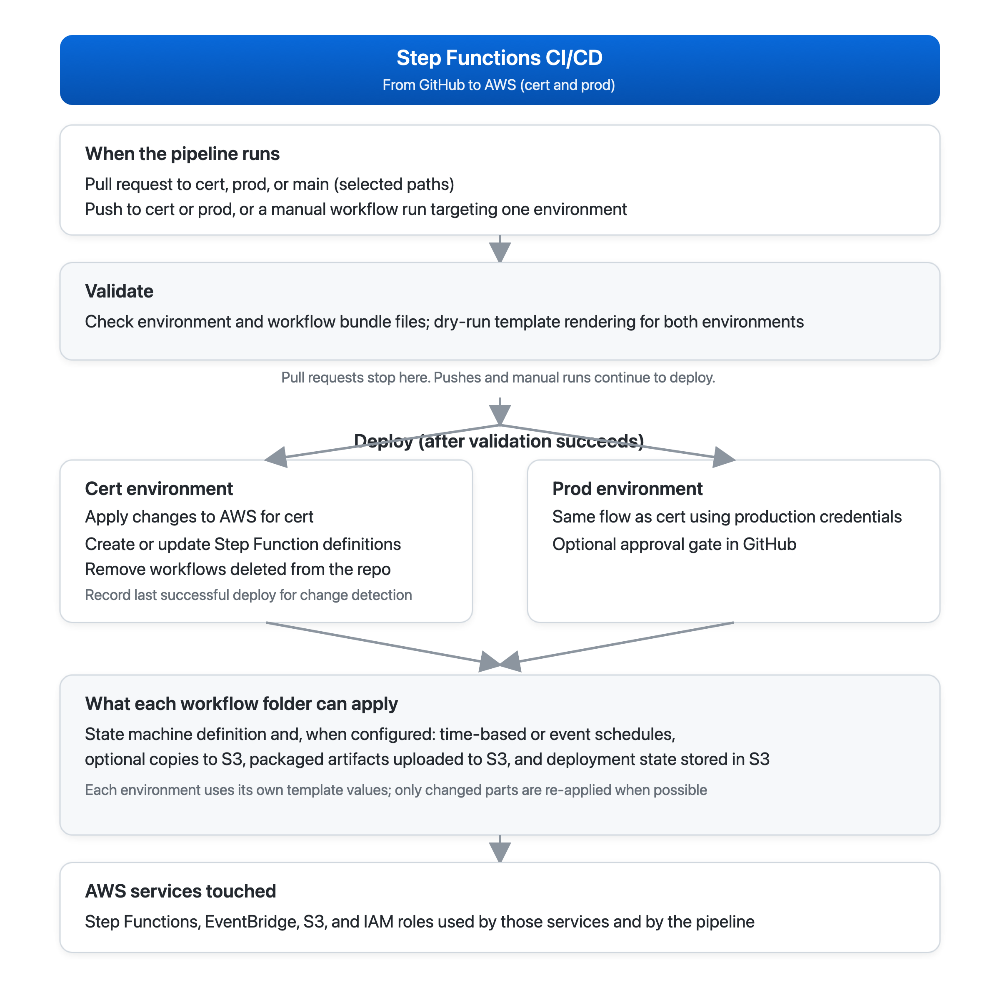

## Step Functions CI/CD (GitHub Actions)

### Overview

This repository contains a **GitHub Actions–driven CI/CD pipeline** to manage **AWS Step Functions state machines** from source control.

- **Branch-based deploys**:
  - **`cert`** branch deploys to **cert**
  - **`prod`** branch deploys to **prod** (can be gated using GitHub Environments approvals)
- **Lifecycle support**: create, update, and delete state machines based on the repo source of truth under `stepfunctions/`.
- **Templated ASL**: definitions in `stepfunctions/definitions/*.asl.json` can contain `${...}` placeholders that are rendered using environment files in `stepfunctions/env/`.

### Architectural overview

- **Source of truth**
  - `stepfunctions/manifest.json` declares workflows (id, definition path, type, tags) and a naming template.
  - `stepfunctions/definitions/*.asl.json` contains the Step Functions ASL definitions (templated).
  - `stepfunctions/env/{cert,prod}.json` provides substitution values for rendering templates.
- **CI/CD orchestration**
  - `.github/workflows/stepfunctions-cicd.yml` validates JSON and renders templates, then runs deploy/delete loops.
- **Deployment mechanism**
  - `scripts/deploy_sfn.sh` uses the AWS CLI to `create-state-machine` or `update-state-machine` and enforces tags.
  - `scripts/delete_sfn.sh` deletes state machines using the same deterministic naming convention.

### Directory structure

- **`.github/workflows/`**
  - `stepfunctions-cicd.yml`: workflow entrypoint (PR validation, branch deploys, manual dispatch)
- **`scripts/`**
  - `deploy_sfn.sh`: create/update a single state machine from a definition
  - `delete_sfn.sh`: delete a single state machine by workflow id
  - `detect_stepfunctions_changes.sh`: compute deploy/delete lists from git diffs and manifest changes
  - `detect_changed_stepfunctions.sh`: legacy helper (changed definitions list)
  - `render_asl.py`: renders `${KEY}` placeholders into a JSON definition
- **`stepfunctions/`**
  - `manifest.json`: workflow registry + naming template
  - `definitions/*.asl.json`: state machine definitions (templated)
  - `env/cert.json`, `env/prod.json`: environment substitution values

### Workflow triggers

The workflow triggers on:

- **pull_request** when files change under:
  - `stepfunctions/**`
  - `scripts/**`
  - `.github/workflows/stepfunctions-cicd.yml`
- **push** to branches **`cert`** or **`prod`** with the same path filters above
- **workflow_dispatch** manual runs with inputs:
  - `environment`: `cert` | `prod`
  - `mode`: `changed` | `all`

### Script usage & logic

#### `scripts/render_asl.py`

- **Usage**: `python3 scripts/render_asl.py <env.json> <input.asl.json> <output.json>`
- **Logic**: Replaces `${KEY}` placeholders using the key/value pairs in the env JSON. Lists/dicts are injected as JSON; scalars are string-injected. Validates the final JSON parses.

#### `scripts/deploy_sfn.sh`

- **Usage**: `scripts/deploy_sfn.sh <cert|prod> <path-to-definition.asl.json>`
- **Logic**:
  - Reads `stepfunctions/manifest.json` and derives:
    - `WF_ID` = filename without `.asl.json`
    - State machine name using `stateMachineNameTemplate` (substitutes `${ENV}` and `${ID}`)
    - `type` and `tags` from the manifest workflow entry
  - Renders the definition using `scripts/render_asl.py` with `stepfunctions/env/<env>.json`
  - Creates or updates the state machine:
    - If not found: `aws stepfunctions create-state-machine`
    - If found: `aws stepfunctions update-state-machine`
  - Enforces tags using `aws stepfunctions tag-resource`

#### `scripts/delete_sfn.sh`

- **Usage**: `scripts/delete_sfn.sh <cert|prod> <workflow-id>`
- **Logic**:
  - Computes the state machine name using the same template as deploy
  - Finds the ARN via `list-state-machines`
  - Deletes using `aws stepfunctions delete-state-machine`

#### `scripts/detect_stepfunctions_changes.sh`

- **Usage**: `scripts/detect_stepfunctions_changes.sh <base_sha> <head_sha>`
- **Output**:
  - `DEPLOY:<definition-path>` lines (create/update)
  - `DELETE:<workflow-id>` lines (delete)
- **Logic**:
  - If anything under `stepfunctions/env/` changed → **deploy all** definitions (safe default).
  - If `stepfunctions/manifest.json` changed:
    - **Deploy only** workflows whose manifest entries changed (new/modified).
    - **Delete** workflows removed from manifest (even if the definition file still exists).
  - Also detects deletes/renames of definition files under `stepfunctions/definitions/*.asl.json`:
    - deleted file → `DELETE:<old_id>`
    - renamed file → `DELETE:<old_id>` and `DEPLOY:<new_path>`

### AWS prerequisites (before running the workflow)

#### 1) GitHub Actions Secrets

Set these secrets in repo settings:

- `AWS_ACCESS_KEY_ID`
- `AWS_SECRET_ACCESS_KEY`
- `AWS_REGION` (example: `us-east-2`)
- `SFN_EXECUTION_ROLE_ARN_CERT`
- `SFN_EXECUTION_ROLE_ARN_PROD`
- `SFN_LOG_GROUP_ARN_CERT` (recommended)
- `SFN_LOG_GROUP_ARN_PROD` (recommended)

#### 2) IAM permissions (high level)

The AWS credentials used by GitHub Actions must be able to:

- **Create/update/delete state machines**: `states:CreateStateMachine`, `states:UpdateStateMachine`, `states:DeleteStateMachine`, `states:ListStateMachines`, `states:TagResource`
- **Pass the Step Functions execution role**: `iam:PassRole` for the role(s) in `SFN_EXECUTION_ROLE_ARN_*`

The **Step Functions execution role** (the role passed to `create-state-machine`) must have permissions required by your ASL definition. For example, the included ECS dummy workflow requires permissions for `ecs:RunTask` and EventBridge integration used by `.sync` patterns.

### Adding / deleting a Step Function (examples)

#### Add (create/update) a workflow

1) Add a definition file:

- `stepfunctions/definitions/orders-ecs-run-task.asl.json`

2) Add a manifest entry:

```json
{
  "id": "orders-ecs-run-task",
  "definition": "stepfunctions/definitions/orders-ecs-run-task.asl.json",
  "type": "STANDARD",
  "tags": { "app": "orders", "managed-by": "github-actions" }
}
```

3) Ensure required placeholders exist in `stepfunctions/env/cert.json` and `stepfunctions/env/prod.json`.

4) Merge to **`cert`** (or **`prod`**) and the pipeline will deploy it to that environment only.

#### Delete a workflow

You have two supported delete paths:

- **Manifest removal** (recommended): remove the workflow entry from `stepfunctions/manifest.json` → pipeline emits `DELETE:<id>` and deletes it.
- **Definition file removal/rename**: deleting/renaming `stepfunctions/definitions/<id>.asl.json` emits delete/rename deletes.

### Deploy all mode

Manual deploy-all is available as:

- **workflow_dispatch** with `mode=all`

Behavior:

- **DEPLOY_LIST** = all tracked definition files in `stepfunctions/definitions/*.asl.json`
- **DELETE_LIST** = empty
- Result: deploy/update everything once for the selected environment without deleting anything.

### Test cases (validated)

1. **Created one step function in cert**: added definition + manifest entry; merged to `cert`; workflow deployed it.
2. **Created another step function**: added a second workflow entry; pipeline deployed it.
3. **Deleted step function**: deletion supported via manifest removal or definition deletion/rename; pipeline deleted the state machine.
4. **Run pipeline without any changes and workflow didn’t get triggered**: due to path filters on `push`/`pull_request`, no-run occurs when nothing under watched paths changes.
5. **If merge to cert branch then it will deploy to cert only**: branch gating ensures cert deploy job runs only for `cert` (prod runs only for `prod`).
6. **Tested deletion workflow by removing one step function from `manifest.json`**: removal emits delete and deletes the state machine.
7. **Tested Deploy all**: manual dispatch with `mode=all` deploys all definitions for the chosen environment.

### Workflow diagram



#### Diagram summary

- **Triggers**: PRs validate changes; pushes to `cert`/`prod` deploy; manual `workflow_dispatch` runs with `mode=changed|all`.
- **Validation**: confirms `manifest.json` and `env/*.json` are valid JSON; renders each ASL template with `cert` env and validates the rendered JSON.
- **Change detection**:
  - If `stepfunctions/env/` changes → deploy all definitions (safe default).
  - If `manifest.json` changes → deploy only workflows whose manifest entries changed; delete workflows removed from the manifest.
  - If definition files are deleted/renamed → delete old workflow id; deploy new path on rename.
- **Deploy loop**: for each item in `DEPLOY_LIST`, runs `deploy_sfn.sh` to create/update state machines and enforce tags.
- **Delete loop**: for each item in `DELETE_LIST`, runs `delete_sfn.sh` to delete the state machine by workflow id.

#### Presentation summary (talk track)

“This project provides a GitHub Actions CI/CD pipeline to manage AWS Step Functions as code. We keep a source-of-truth manifest and templated ASL definitions in the repo, and environment-specific values in `cert` and `prod` JSON files. On every PR we validate JSON and render templates to ensure the final state machine definitions are valid. When changes are merged to the `cert` or `prod` branches, the pipeline detects what’s new, updated, or removed, then runs a deploy loop to create or update only the affected state machines, and a delete loop to remove workflows that were deleted or removed from the manifest. We also support a manual ‘deploy all’ mode to redeploy all definitions safely without deletions. Overall, it standardizes Step Functions deployments, makes changes auditable via git history, and keeps cert and prod deployments controlled by branch and environment gating.”
